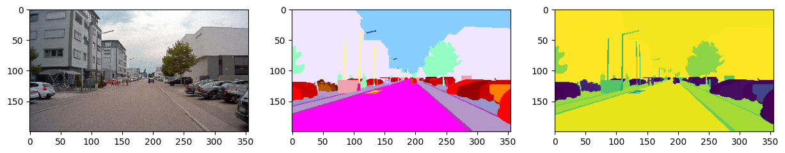
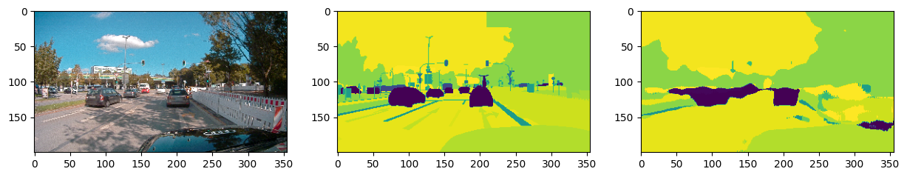

This repository presents an enhanced approach to the A2D2 dataset. I used it as a testing ground for new ideas and methodologies. However, due to limited computing resources, I paused development to prioritize other projects.

(The dataset was cleaned using Albumentations to downscale the resolution without introducing artifacts)

Dataset example:

Prediction example:

